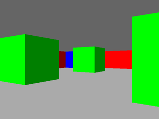
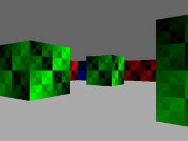
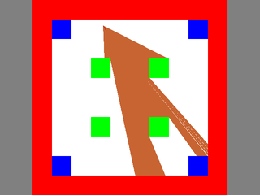

Raycaster-SDL
=============

A simple Ray Casting 3D engine using SDL as the rendering back-end.

Overview
--------

This project is a typical textured Ray Casting engine akin to games like Wolfenstein 3D, Blake Stone, etc.

The crux of this program is not that it is an efficient implementation, or that it contains special rendering
features. Instead, this Ray Caster is unique (as far as I have seen) in that the engine is built almost entirely
on top of fundamental Linear Algebra concepts (vectors, transformation matrices, vector projection, etc.),
even down to stepping vector calculation, which uses a modified form of vector projection.

The rationale for this is simply that this was designed as a teaching aide for students in a computer graphics
course to help solidify their knowledge of fundamental Linear Algebra concepts (and also give them something nice
to look at).

On that note, there does exist accompanying teaching material for this Ray Caster which I authored - but since I
do not currently have permission from the relevant academic institution, I cannot upload those. If time permits,
and if there's interest, I'd be more than happy to produce some new material to help people understand how this
engine works.


Requirements
------------

This project requires the following libraries:

- SDL2


Compiling
---------

Unlike most of my other projects, this project does not rely on any build system.
To compile the project, simply navigate to the root of the project and enter the following command:

```
gcc -lm -lSDL2 -O2 src/*.c -o raycaster
```


Running
-------

To run the Ray Caster, enter `./raycaster` into your shell.


Using the Ray Caster
--------------------

The Ray Caster accepts the following controls:

`Left`    Turn left.  
`Right`   Turn right.  
`Up`      Move forward.  
`Down`    Move backward.  
`Shift`   Hold to move twice as fast.  
`t`       Toggle between textured and untextured rendering.  
`m`       Toggle the full screen map on/off.  
`f`       Toggle the barrel distortion correction on/off.  
`[`       Decrease the distance to the viewplace (increase FOV)  
`]`       Increase the distance to the viewplace (decrease FOV)  
`escape`  Quit the game.


Screenshots
-----------

 



Licence
-------

See LICENCE for details.
